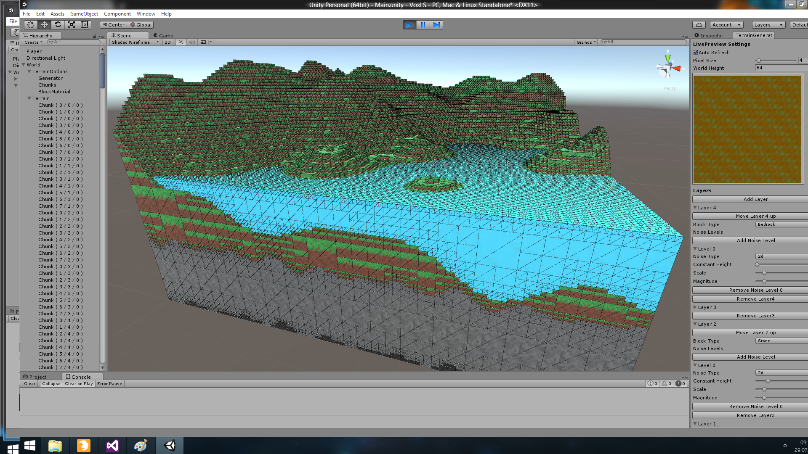

# Octree Voxel Terrain Generator

A terrain generator using Unity3D and octree datastructure.
It offers an user-friendly UI interface to add different noise levels and block types.

## Screenshots

## Getting started
Open the project in Unity, drag the "World" prefab from Assets/Resources/Prefabs into the Hierarchy.
Now you can use the TerrainGenerator toolbar to add layers, different noise levels to customize your terrain generation.
You can click the "Generate Preview" button to see a 2D preview of your scene.
Finally press the play button to actually generate the terrain. Use the scene view to inspect it.

